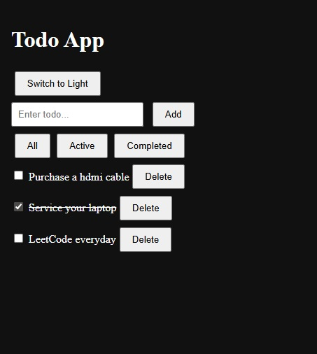

#### Context-API-Implementation

This project is a Todo application built using React that demonstrates modern state management with the Context API and useReducer. It allows users to add, edit, delete, and filter todos while also supporting theme switching between light and dark modes. The app also persists data using localStorage, so todos and theme settings remain available even after refreshing the page.

The technology stack used includes React for building the user interface, TypeScript for type safety, and Vite as the build tool for fast development and bundling. It uses React Context API for global state management, useReducer for handling complex todo logic, and the browser’s localStorage for persistence. Basic CSS is used for styling and layout.

#### Screenshot

